# En construccion

# TO DO

- [ ] Hacer los diagramas de flujo, BD, Secuencia, Bloques, Estructura y Arquitectura
- [ ] Implementar en los logs el resultado de pytest `1 passed in 5.20s`
- [ ] Implementar los test simulando el Front

## Descipción.

Proyecto para conectar el ESP32 WROOM por medio de la red local usando un servidor en Python usando WebSocket, sqlite3 para almacenar los datos y una [Pagina web en Astro.js Con react de micro-frontend (Spoiler mala idea jsjsj)](https://github.com/Sebaxsus/PaginaDashboardSensor)


## Observaciones.

> [!NOTE]
>
> Probando la duración de bateria y consumo del ESP32 teniendo:
> 1. LED Rojo con una resistencia de 220 Ohms.
> 2. Sensor de GAS MQ-40.
> 3. ESP32 usando el Modulo WIFI Integrado.
>
> Se concluye que con una Bateria de 10000 mAh a 3.7V
> -- Sebaxsus

> [!NOTE]
>
> Especificaciones de la bateria externa
> 
> 10000 mili Amperios hora - mAh
> Power: 37 Watts hora - Wh
> Input: 5 Voltios / 2 Amperios - 5V/2A
> OutPut: 5 Voltios / 2 Amperios - 5/2A
> Letras Chinas: 6800 mili Amperios hora - mAh


## Tabla de contenidos

1. [Descripción General.](#descipción)
2. [Observaciones.](#observaciones)
3. [Tabla de contenidos.](#tabla-de-contenidos)
4. [Instalación.](#instalación)
5. [Configuración.](#configuracion)
6. [Diagramas.](#diagramas)
7. [Test.](#Test)
8. [Autor.](#autor)
9. [Licencia.](#licencia)

## Instalación.

**Para instalar el Programa se necesita**
- **Arduino:**
    1. [Arduino IDE](https://www.arduino.cc/en/software/).
    2. Instalar en Arduino el Modulo de compatibilidad con el [ESP32 de Expressif](https://docs.espressif.com/projects/arduino-esp32/en/latest/installing.html#installing-using-arduino-ide)
> [!IMPORTANT]
>
> Para hacer esto toca configurar arudino con un link externo arriba esta el Link de la guia de Instalacion y configuracion por ExpressIf
>
> Ademas de esto dentro de Arduino en la Seccion de Boards Manager toca agregar **ESP32 By ExpressIf**.
    3. Instalar la Libreria para manejar los **WebSockets INET y STREAMS** por Protocolo TCP LLamada [WebSockets By Marcus Sattler](https://github.com/Links2004/arduinoWebSockets/tree/master/src).
    4. Instalar la Libreria para manejar el Modulo 7 Segmentos de 4 Llamado [TM1637 By Avishay Orpaz](https://github.com/avishorp/TM1637).
- **Python (Servidor):**
    1. [Python 3.12^](https://www.python.org/downloads/).
    2. **Opcional:**
        - Entorno Virtual: [UV](https://github.com/astral-sh/uv/blob/main/README.md).

## Configuracion.

No es necesario, Lo unico es si se va usar UV Tenerlo Instalado y dentro de el PATH de la Maquina para que la terminal entianda el comando.

```bash
uv -venv Nombre_De_El_Entorno_Virtual
cd Nombre_De_El_Entorno_Virtual
uv pip install -r requiremets.txt

uv pip sync requiremets.txt
```

## Diagramas

- [ ] Por hacer 👍.

**Flujo del Servidor WebSocket**

```mermaid
flowchart TD
    A[Inicio del Servidor] --> B[Configura Logger y DB]
    B --> C[Escucha conexiones WebSocket]
    C --> D{¿Ruta /dashboard?}
    D -- Sí --> E[Filtra histórico desde SQLite]
    D -- No --> F[Espera datos desde el cliente]
    F --> G{Evento: sensor_data}
    G -- Sí --> H[Guardar en DB y Responder OK]
    G -- No --> I[Ignorar o responder error]
    E --> J[Envía histórico al cliente]
    H --> K[Continúa escuchando]
    I --> K
    J --> K
```



**Flujos de los Test Automáticos en Pytest**

```mermaid
flowchart TD
    A[Pytest Inicia] --> B[Fixture start_test_server]
    B --> C[Define DB temporal y lanza el servidor]
    C --> D[Test espera 5s]
    D --> E[TestClass ejecuta test_one]
    E --> F[Se conecta al WebSocket]
    F --> G[Envía JSON simulado]
    G --> H[Recibe respuesta del servidor]
    H --> I[Valida respuesta con assert]
    I --> J[TestClass ejecuta test_two]
    J --> K[Recibe datos de histórico]
    K --> L[Valida tipo y contenido]
    L --> M[Hook pytest_terminal_summary]
    M --> N[Logger escribe resumen del test]
```



**Estructura de Módulos**

```mermaid
graph TD
    Server[server.py] --> Logger
    Server --> DataBase
    Server --> WebSocket

    Logger[Logger.py] -->|get_Logger()| Logging[logging]

    DataBase[Data_Base.py] -->|connect()| SQLite[SQLite]
    DataBase -->|context manager| Server

    WebSocket[websockets] --> Server

    Test[TestClass] -->|simula cliente| WebSocket
    Test -->|usa fixture| Server
    Test --> Logger
```

## Test

Para ejecutar el test dentro de un entorno virtual se debe tener instalado `pytest y pytest-asyncio`,
> [!IMPORTANT]
>
> En caso de usar un `Entorno Virtual`, Primero se debe activar el entorno virtual
>
> ```bash
> .\Venv\Scripts\activate
> ```

Luego se ejecuta el siguiente comando dentro de el root de el proyecto (WebSocket Con Flask):
```bash
pytest .\Test\Testing_With_Pytest.py -s
```


## Autor

[Sebaxsus](https://github.com/Sebaxsus).

## Licencia

[MIT License](./LICENSE)
